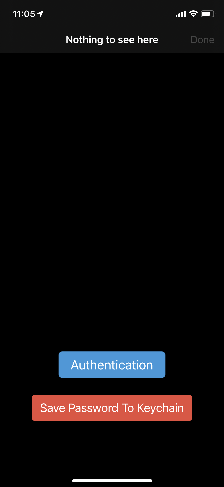
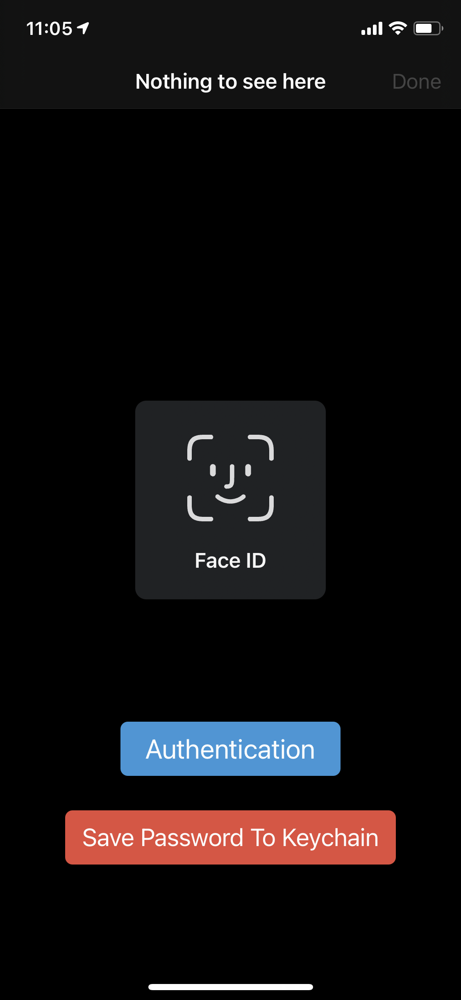

# Biometric

This a biometric iOS app only to learn about how you can use Touch ID and Face ID biometrics for your apps.

[KeychainWrapper](https://github.com/jrendel/SwiftKeychainWrapper) is used for saving the manual password to Keychain, which is protected under MIT license.

</img>
</img>
</img>
